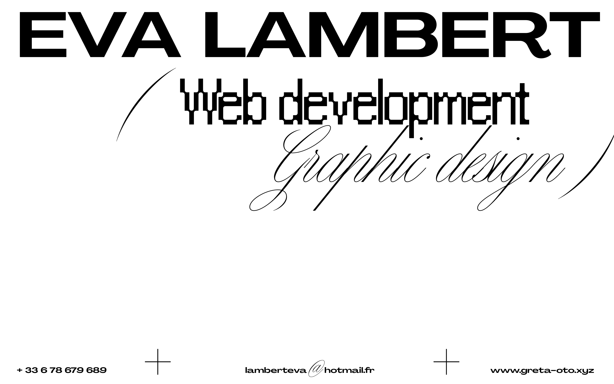
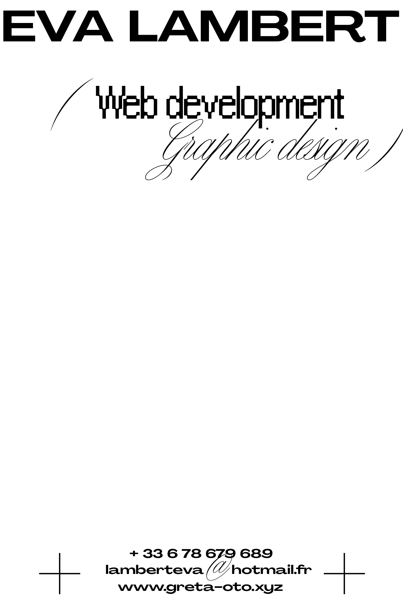
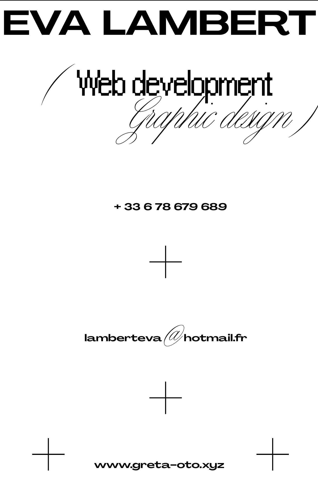

# 📇 VCARD

## 🔗 LIEN VERS LE PROJET

[https://evalambert.github.io/vcard/](https://evalambert.github.io/vcard/)

## 🎯 OBJECTIFS

- Html sémantique
- Positionnement CSS

## 👉 CONSIGNES

- Créer un repository
- Créer une Vcard en HTML et CSS
- Utiliser le positionnement en CSS
- Commiter and pusher
- Déployer sur une page Github

## 🌐 LANGUAGE UTILISÉ

HTML & CSS

## ⏰ ÉTAT D'AVANCEMENT

Terminé 🙃

## 👀 MAQUETTE DU PROJET

